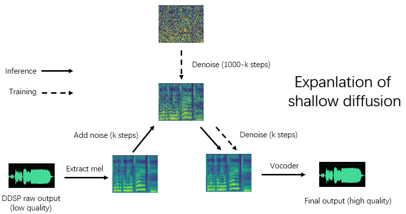

Language: **English** [简体中文](./cn_README.md) [한국어（outdated）](./ko_README.md)

# DDSP-SVC

## (4.0 - Update) New DDSP cascade diffusion model

Installing dependencies, data preparation, configuring the pre-trained encoder (hubert or contentvec ) , pitch extractor (RMVPE) and vocoder (nsf-hifigan) are the same as training a pure DDSP model (See section below).

We provide a pre-trained model here: <https://huggingface.co/datasets/ms903/DDSP-SVC-4.0/resolve/main/pre-trained-model/model_0.pt> (using 'contentvec768l12' encoder)

Move the `model_0.pt` to the model export folder specified by the 'expdir' parameter in `diffusion-new.yaml`, and the program will automatically load the pre-trained model in that folder.

(1) Preprocessing：

```bash
python preprocess.py -c configs/diffusion-new.yaml
```

(2) Train a cascade model (only train one model)：

```bash
python train_diff.py -c configs/diffusion-new.yaml
```

Note: There is a temporary problem with fp16 training, but fp32 and bf16 are working normally,

(3) Non-real-time inference：

```bash
python main_diff.py -i <input.wav> -diff <diff_ckpt.pt> -o <output.wav> -k <keychange (semitones)> -id <speaker_id> -speedup <speedup> -method <method> -kstep <kstep>
```

The 4.0 version model has a built-in DDSP model, so specifying an external DDSP model using `-ddsp` is unnecessary. The other options have the same meaning as the 3.0 version model, but 'kstep' needs to be less than or equal to `k_step_max` in the configuration file, it is recommended to keep it equal (the default is 100)

(4) Real-time GUI：

```bash
python gui_diff.py
```

Note: You need to load the version 4.0 model on the right hand side of the GUI

## (3.0 - Update) Shallow diffusion model (DDSP + Diff-SVC refactor version)



Installing dependencies, data preparation, configuring the pre-trained encoder (hubert or contentvec ) , pitch extractor (RMVPE) and vocoder (nsf-hifigan) are the same as training a pure DDSP model (See chapter 1 \~ 3 below).

Because the diffusion model is more difficult to train, we provide some pre-trained models here:

<https://huggingface.co/datasets/ms903/Diff-SVC-refactor-pre-trained-model/blob/main/hubertsoft_fix_pitch_add_vctk_500k/model_0.pt> (using 'hubertsoft' encoder)

<https://huggingface.co/datasets/ms903/Diff-SVC-refactor-pre-trained-model/blob/main/fix_pitch_add_vctk_600k/model_0.pt> (using 'contentvec768l12' encoder)

Move the `model_0.pt` to the model export folder specified by the 'expdir' parameter in `diffusion.yaml`, and the program will automatically load the pre-trained models in that folder.

(1) Preprocessing：

```bash
python preprocess.py -c configs/diffusion.yaml
```

This preprocessing can also be used to train the DDSP model without preprocessing twice, but you need to ensure that the parameters under the 'data' tag in yaml files are consistent.

(2) Train a diffusion model：

```bash
python train_diff.py -c configs/diffusion.yaml
```

(3) Train a DDSP model：

```bash
python train.py -c configs/combsub.yaml
```

As mentioned above, re-preprocessing is not required, but please check whether the parameters of `combsub.yaml` and `diffusion.yaml` match. The number of speakers 'n_spk' can be inconsistent, but try to use the same id to represent the same speaker (this makes inference easier).

(4) Non-real-time inference：

```bash
python main_diff.py -i <input.wav> -ddsp <ddsp_ckpt.pt> -diff <diff_ckpt.pt> -o <output.wav> -k <keychange (semitones)> -id <speaker_id> -diffid <diffusion_speaker_id> -speedup <speedup> -method <method> -kstep <kstep>
```

'speedup' is the acceleration speed, 'method' is 'ddim', 'pndm', 'dpm-solver' or 'unipc', 'kstep' is the number of shallow diffusion steps, 'diffid' is the speaker id of the diffusion model, and other parameters have the same meaning as `main.py`.

A reasonable 'kstep' is about 100\~300. There may be a perceived loss of sound quality when ‘speedup’ exceeds 20.

If the same id has been used to represent the same speaker during training, '-diffid' can be empty, otherwise the '-diffid' option needs to be specified.

If '-ddsp' is empty, the pure diffusion model is used, at this time, shallow diffusion is performed with the mel of the input source, and if further '-kstep' is empty, full-depth Gaussian diffusion is performed.

The program will automatically check whether the parameters of the DDSP model and the diffusion model match (sampling rate, hop size and encoder), and if they do not match, it will ignore loading the DDSP model and enter Gaussian diffusion mode.

(5) Real-time GUI：

```bash
python gui_diff.py
```

## 0. Introduction

DDSP-SVC is a new open source singing voice conversion project dedicated to the development of free AI voice changer software that can be popularized on personal computers.

Compared with the famous [SO-VITS-SVC](https://github.com/svc-develop-team/so-vits-svc), its training and synthesis have much lower requirements for computer hardware, and the training time can be shortened by orders of magnitude, which is close to the training speed of [RVC](https://github.com/RVC-Project/Retrieval-based-Voice-Conversion-WebUI).

In addition, when performing real-time voice changing, the hardware resource consumption of this project is significantly lower than that of SO-VITS-SVC，but probably slightly higher than the latest version of RVC.

Although the original synthesis quality of DDSP is not ideal (the original output can be heard in tensorboard while training), after enhancing the sound quality with a pre-trained vocoder based enhancer (old version) or with a shallow diffusion model (new version) , for some datasets, it can achieve the synthesis quality no less than SOVITS-SVC and RVC.

The old version models are still compatible, the following chapters are the instructions for the old version. Some operations of the new version are the same, see the previous chapters.

Disclaimer: Please make sure to only train DDSP-SVC models with **legally obtained authorized data**, and do not use these models and any audio they synthesize for illegal purposes. The author of this repository is not responsible for any infringement, fraud and other illegal acts caused by the use of these model checkpoints and audio.

Update log: I am too lazy to translate, please see the Chinese version readme.

## 1. Installing the dependencies

We recommend first installing PyTorch from the [official website](https://pytorch.org/), then run:

```bash
pip install -r requirements.txt
```

NOTE : I only test the code using python 3.8 (windows) + torch 1.9.1 + torchaudio 0.6.0, too new or too old dependencies may not work

UPDATE: python 3.8 (windows) + cuda 11.8 + torch 2.0.0 + torchaudio 2.0.1 works, and training is faster.

## 2. Configuring the pretrained model

- Feature Encoder (choose only one):

(1) Download the pre-trained [ContentVec](https://ibm.ent.box.com/s/z1wgl1stco8ffooyatzdwsqn2psd9lrr) encoder and put it under `pretrain/contentvec` folder.

(2) Download the pre-trained [HubertSoft](https://github.com/bshall/hubert/releases/download/v0.1/hubert-soft-0d54a1f4.pt) encoder and put it under `pretrain/hubert` folder, and then modify the configuration file at the same time.

- Vocoder or enhancer:

Download the pre-trained [NSF-HiFiGAN](https://github.com/openvpi/vocoders/releases/download/nsf-hifigan-v1/nsf_hifigan_20221211.zip) vocoder and unzip it into `pretrain/` folder.

- Pitch extractor:

Download the pre-trained [RMVPE](https://github.com/yxlllc/RMVPE/releases/download/230917/rmvpe.zip) extractor and unzip it into `pretrain/` folder.

## 3. Preprocessing

Put all the training dataset (.wav format audio clips) in the below directory: `data/train/audio`. Put all the validation dataset (.wav format audio clips) in the below directory: `data/val/audio`. You can also run

```bash
python draw.py
```

to help you select validation data (you can adjust the parameters in `draw.py` to modify the number of extracted files and other parameters)

Then run

```bash
python preprocess.py -c configs/combsub.yaml
```

for a model of combtooth substractive synthesiser (**recommend**), or run

```bash
python preprocess.py -c configs/sins.yaml
```

for a model of sinusoids additive synthesiser.

For training the diffusion model, see section 3.0 or 4.0 above.

You can modify the configuration file `config/<model_name>.yaml` before preprocessing. The default configuration is suitable for training 44.1khz high sampling rate synthesiser with GTX-1660 graphics card.

NOTE 1: Please keep the sampling rate of all audio clips consistent with the sampling rate in the yaml configuration file ! If it is not consistent, the program can be executed safely, but the resampling during the training process will be very slow.

NOTE 2: The total number of the audio clips for training dataset is recommended to be about 1000, especially long audio clip can be cut into short segments, which will speed up the training, but the duration of all audio clips should not be less than 2 seconds. If there are too many audio clips, you need a large internal-memory or set the 'cache_all_data' option to false in the configuration file.

NOTE 3: The total number of the audio clips for validation dataset is recommended to be about 10, please don't put too many or it will be very slow to do the validation.

NOTE 4: If your dataset is not very high quality, set 'f0_extractor' to 'rmvpe' in the config file.

NOTE 5: Multi-speaker training is supported now. The 'n_spk' parameter in configuration file controls whether it is a multi-speaker model. If you want to train a **multi-speaker** model, audio folders need to be named with **positive integers not greater than 'n_spk'** to represent speaker ids, the directory structure is like below:

```bash
# training dataset
# the 1st speaker
data/train/audio/1/aaa.wav
data/train/audio/1/bbb.wav
...
# the 2nd speaker
data/train/audio/2/ccc.wav
data/train/audio/2/ddd.wav
...

# validation dataset
# the 1st speaker
data/val/audio/1/eee.wav
data/val/audio/1/fff.wav
...
# the 2nd speaker
data/val/audio/2/ggg.wav
data/val/audio/2/hhh.wav
...
```

If 'n_spk' \= 1, The directory structure of the **single speaker** model is still supported, which is like below:

```bash
# training dataset
data/train/audio/aaa.wav
data/train/audio/bbb.wav
...
# validation dataset
data/val/audio/ccc.wav
data/val/audio/ddd.wav
...
```

## 4. Training

```bash
# train a combsub model as an example
python train.py -c configs/combsub.yaml
```

The command line for training other models is similar.

You can safely interrupt training, then running the same command line will resume training.

You can also finetune the model if you interrupt training first, then re-preprocess the new dataset or change the training parameters (batchsize, lr etc.) and then run the same command line.

## 5. Visualization

```bash
# check the training status using tensorboard
tensorboard --logdir=exp
```

Test audio samples will be visible in TensorBoard after the first validation.

NOTE: The test audio samples in Tensorboard are the original outputs of your DDSP-SVC model that is not enhanced by an enhancer. If you want to test the synthetic effect after using the enhancer (which may have higher quality) , please use the method described in the following chapter.

## 6. Non-real-time VC

(**Recommend**) Enhance the output using the pretrained vocoder-based enhancer:

```bash
# high audio quality in the normal vocal range if enhancer_adaptive_key = 0 (default)
# set enhancer_adaptive_key > 0 to adapt the enhancer to a higher vocal range
python main.py -i <input.wav> -m <model_file.pt> -o <output.wav> -k <keychange (semitones)> -id <speaker_id> -eak <enhancer_adaptive_key (semitones)>
```

Raw output of DDSP:

```bash
# fast, but relatively low audio quality (like you hear in tensorboard)
python main.py -i <input.wav> -m <model_file.pt> -o <output.wav> -k <keychange (semitones)> -id <speaker_id> -e false
```

Other options about the f0 extractor and response threhold，see:

```bash
python main.py -h
```

(UPDATE) Mix-speaker is supported now. You can use "-mix" option to design your own vocal timbre, below is an example:

```bash
# Mix the timbre of 1st and 2nd speaker in a 0.5 to 0.5 ratio
python main.py -i <input.wav> -m <model_file.pt> -o <output.wav> -k <keychange (semitones)> -mix "{1:0.5, 2:0.5}" -eak 0
```

## 7. Real-time VC

Start a simple GUI with the following command:

```bash
python gui.py
```

The front-end uses technologies such as sliding window, cross-fading, SOLA-based splicing and contextual semantic reference, which can achieve sound quality close to non-real-time synthesis with low latency and resource occupation.

Update: A splicing algorithm based on a phase vocoder is now added, but in most cases the SOLA algorithm already has high enough splicing sound quality, so it is turned off by default. If you are pursuing extreme low-latency real-time sound quality, you can consider turning it on and tuning the parameters carefully, and there is a possibility that the sound quality will be higher. However, a large number of tests have found that if the cross-fade time is longer than 0.1 seconds, the phase vocoder will cause a significant degradation in sound quality.

## 8. Acknowledgement

- [ddsp](https://github.com/magenta/ddsp)

- [pc-ddsp](https://github.com/yxlllc/pc-ddsp)

- [soft-vc](https://github.com/bshall/soft-vc)

- [ContentVec](https://github.com/auspicious3000/contentvec)

- [DiffSinger (OpenVPI version)](https://github.com/openvpi/DiffSinger)

- [Diff-SVC](https://github.com/prophesier/diff-svc)
