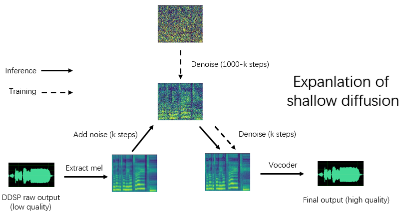

语言: [English](./README.md) **简体中文** [한국어](./ko_README.md)
# DDSP-SVC

## (6.0 - 实验性更新) 新的基于修正流的模型

(1) 数据预处理：

```bash
python -m ddspsvc.preprocess -c configs/reflow.yaml
```

(2) 训练：

```bash
python -m ddspsvc.train_reflow -c configs/reflow.yaml
```

(3) 非实时推理：

```bash
python -m ddspsvc.main_reflow -i <input.wav> -m <model_ckpt.pt> -o <output.wav> -k <keychange（半音）> -id <说话者ID> -step <推理步骤> -method <方法> -ts <开始时间>
```
'infer_step' 是修正流 ODE 的采样步骤数，'method' 是 'euler' 或 'rk4'，'t_start' 是 ODE 的起始时间点，需要大于或等于配置文件中的 `t_start`，建议保持相等（默认为 0.7）


## (5.0 - 更新) 改进的 DDSP 级联扩散模型

安装依赖项、数据准备、配置预训练编码器（hubert 或 contentvec）、音高提取器（RMVPE）和声码器（nsf-hifigan）与训练纯 DDSP 模型相同（参见下文）。

我们在发布页面提供了一个预训练模型。

将 `model_0.pt` 移动到 `diffusion-fast.yaml` 中 'expdir' 参数指定的模型导出文件夹，并且程序将自动加载该文件夹中的预训练模型。

(1) 数据预处理：

```bash
python -m ddspsvc.preprocess -c configs/diffusion-fast.yaml
```

(2) 训练级联模型（仅训练一个模型）：

```bash
python -m ddspsvc.train_diff -c configs/diffusion-fast.yaml
```

(3) 非实时推理：

```bash
python -m ddspsvc.main_diff -i <input.wav> -diff <diff_ckpt.pt> -o <output.wav> -k <keychange（半音）> -id <说话者ID> -speedup <加速度> -method <方法> -kstep <kstep>
```

5.0 版本模型内置了 DDSP 模型，因此使用 `-ddsp` 指定外部 DDSP 模型是不必要的。其他选项的含义与 3.0 版本模型相同，但 'kstep' 需要小于或等于配置文件中的 `k_step_max`，建议保持相等（默认为 100）

(4) 实时 GUI：

```bash
python -m ddspsvc.gui_diff
```

注意：您需要在 GUI 的右侧加载 5.0 版本模型


## (4.0 - 更新) 新的 DDSP 级联扩散模型

安装依赖项、数据准备、配置预训练编码器（hubert 或 contentvec）、音高提取器（RMVPE）和声码器（nsf-hifigan）与训练纯 DDSP 模型相同（参见下文）。

我们在此提供了一个预训练模型：[点击此处下载](https://huggingface.co/datasets/ms903/DDSP-SVC-4.0/resolve/main/pre-trained-model/model_0.pt)（使用 'contentvec768l12' 编码器）

将 `model_0.pt` 移动到 `diffusion-new.yaml` 中 'expdir' 参数指定的模型导出文件夹，并且程序将自动加载该文件夹中的预训练模型。

(1) 数据预处理：

```bash
python -m ddspsvc.preprocess -c configs/diffusion-new.yaml
```

(2) 训练级联模型（仅训练一个模型）：

```bash
python -m ddspsvc.train_diff -c configs/diffusion-new.yaml
```

注意：fp16 训练存在临时问题，但是 fp32 和 bf16 正常工作。

(3) 非实时推理：

```bash
python -m ddspsvc.main_diff -i <input.wav> -diff <diff_ckpt.pt> -o <output.wav> -k <keychange（半音）> -id <说话者ID> -speedup <加速度> -method <方法> -kstep <kstep>
```

4.0 版本模型内置了 DDSP 模型，因此使用 `-ddsp` 指定外部 DDSP 模型是不必要的。其他选项的含义与 3.0 版本模型相同，但 'kstep' 需要小于或等于配置文件中的 `k_step_max`，建议保持相等（默认为 100）

(4) 实时 GUI：

```bash
python -m ddspsvc.gui_diff
```

注意：您需要在 GUI 的右侧加载 4.0 版本模型


## (3.0 - 更新) 浅层扩散模型（DDSP + Diff-SVC 重构版）



安装依赖项、数据准备、配置预训练编码器（hubert 或 contentvec）、音高提取器（RMVPE）和声码器（nsf-hifigan）与训练纯 DDSP 模型相同（参见第 1 \~ 3 章）。

由于扩散模型更难训练，我们在此提供了一些预训练模型：

[ContentVec](https://github.com/auspicious3000/contentvec) 编码器预训练模型

[HubertSoft](https://github.com/bshall/hubert/releases/download/v0.1/hubert-soft-0d54a1f4.pt) 编码器预训练模型

[NSF-HiFiGAN](https://github.com/openvpi/vocoders/releases/download/nsf-hifigan-44.1k-hop512-128bin-2024.02/nsf_hifigan_44.1k_hop512_128bin_202

4.02.zip) 声码器预训练模型

[RMVPE](https://github.com/yxlllc/RMVPE/releases/download/230917/rmvpe.zip) 音高提取器预训练模型

将下载的预训练模型移动到相应的文件夹，并修改配置文件中的路径。

## 3. 数据预处理

将所有训练数据集（.wav 格式音频片段）放在以下目录中：`data/train/audio`。将所有验证数据集（.wav 格式音频片段）放在以下目录中：`data/val/audio`。您也可以运行

```bash
python -m ddspsvc.draw
```

以帮助您选择验证数据（您可以调整 `-m ddspsvc.draw` 中的参数以修改提取的文件数量和其他参数）

然后运行

```bash
python -m ddspsvc.preprocess -c configs/combsub.yaml
```

用于 combtooth substractive synthesiser 模型的数据预处理（**推荐**），或者运行

```bash
python -m ddspsvc.preprocess -c configs/sins.yaml
```

用于 sinusoids additive synthesiser 模型的数据预处理。

有关训练扩散模型的详细信息，请参见上文的第 3.0、4.0 或 5.0 章节。

您可以在预处理之前修改配置文件 `config/<model_name>.yaml`。默认配置适用于使用 GTX-1660 显卡训练 44.1kHz 高采样率声码器。

## 4. 训练

```bash
# 以 combsub 模型为例进行训练
python -m ddspsvc.train -c configs/combsub.yaml
```

训练其他模型的命令行类似。

您可以安全地中断训练，然后再次运行相同的命令行以恢复训练。

如果首先中断训练，然后重新预处理新数据集或更改训练参数（批处理大小、学习率等），然后再次运行相同的命令行，您还可以微调模型。

## 5. 可视化

```bash
# 使用 tensorboard 检查训练状态
tensorboard --logdir=exp
```

在第一次验证后，测试音频样本将在 TensorBoard 中可见。

注意：Tensorboard 中的测试音频样本是您的 DDSP-SVC 模型的原始输出，未经增强器增强。如果您想测试使用增强器（可能具有更高质量）增强后的合成效果，请使用以下章节中描述的方法。

## 6. 非实时 VC

（**推荐**）使用预训练声码器增强器增强输出：

```bash
# 如果 enhancer_adaptive_key = 0（默认），则在正常音域中具有高音质
# 将 enhancer_adaptive_key > 0 以将增强器调整到更高的音域
python -m ddspsvc.main -i <input.wav> -m <model_file.pt> -o <output.wav> -k <keychange（半音）> -id <说话者ID> -eak <增强器自适应键（半音）>
```

DDSP 的原始输出：

```bash
# 快速，但相对低音质（就像您在 tensorboard 中听到的）
python -m ddspsvc.main -i <input.wav> -m <model_file.pt> -o <output.wav> -k <keychange（半音）> -id <说话者ID> -e false
```

有关音高提取器和响应阈值的其他选项，请参见：

```bash
python -m ddspsvc.main -h
```

（更新）现在支持混合说话者。您可以使用 "-mix" 选项设计自己的声音品质，以下是一个示例：

```bash
# 在 1st 和 2nd 说话者之间以 0.5 到 0.5 的比例混合音色
python -m ddspsvc.main -i <input.wav> -m <model_file.pt> -o <output.wav> -k <keychange（半音）> -mix "{1:0.5, 2:0.5}" -eak 0
```

## 7. 实时 VC

使用以下命令启动一个简单的 GUI：

```bash
python -m ddspsvc.gui
```

前端使用滑动窗口、交叉淡入淡出、基于 SOLA 的拼接和上下文语义参考等技术，可以实现接近非实时合成的声音质量，同时具有低延迟和资源占用。

更新：现在添加了基于相位估计器的拼接算法，但在大多数情况下，SOLA 算法已经具有足够高的拼接声音质量，因此默认情况下已关闭。如果您追求极低延迟的实时声音质量，可以考虑打开它并仔细调整参数，这样可能会使声音质量更高。然而，大量测试发现，如果淡入淡出时间长于 0.1 秒，则相位估计器会导致声音质量显著下降。

## 8. 致谢

- [ddsp](https://github.com/magenta/ddsp)

- [pc-ddsp](https://github.com/yxlllc/pc-ddsp)

- [soft-vc](https://github.com/bshall/soft-vc)

- [ContentVec](https://github.com/auspicious3000/contentvec)

- [DiffSinger (OpenVPI 版本)](https://github.com/openvpi/DiffSinger)

- [Diff-SVC](https://github.com/prophesier/diff-svc)

- [Diffusion-SVC](https://github.com/CNChTu/Diffusion-SVC)